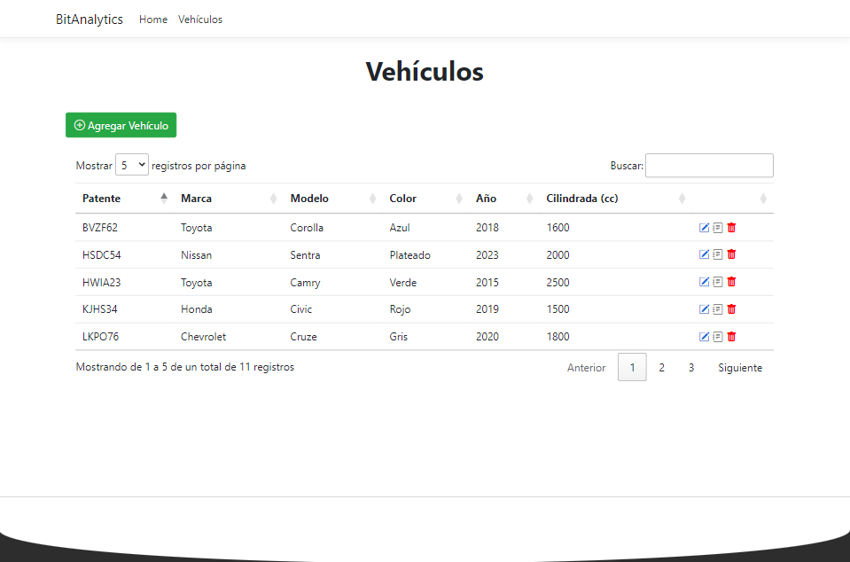
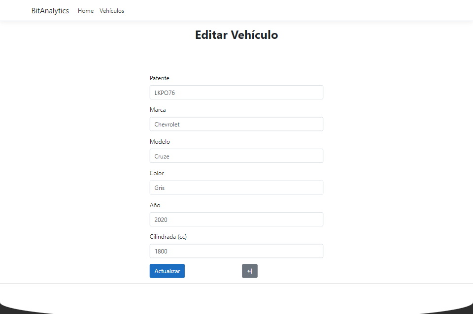

# BitAnalytics

### Introducción:
Este proyecto fue realizado con el fin de realizar un CRUD para una tabla con sus campos

### Problemática
Crear mantenedor de Vehículos con CRUD

### Tecnologías:
- ASP.NET CORE MVC
- SQLite
- HTML
- CSS
- Bootstrap

### Consideraciones para su implementación:
+ Versión .NET 5.0
+ Visual Studio 2019
+ NuGet
  + Microsoft.EntityFrameworkCore.Sqlite
    + Versión: 5.0.10
  + Microsoft.VisualStudio.Web.CodeGeneration.Design
    + Versión: 5.0.2

### Galería

